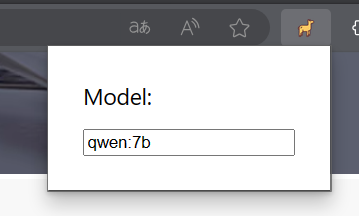
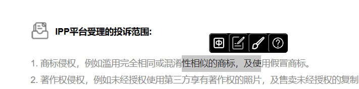

# Ollama Assistant

*empower browser interaction with ollama*

## Feature

* chinese translate, summary, decorate, explain highlighted text

## Prerequisite

It is suggested to [close COR restriction of ollama](https://github.com/ollama/ollama/blob/main/docs/faq.md)(set env `OLLAMA_ORIGINS` `*`) since ollama has cors restriction by default.

## QuickStart

1. config the model installed

2. highlight text and click prompt button

## Todo

* custom prompt
* ollama address config
* extract data from html
* fill data to form in html